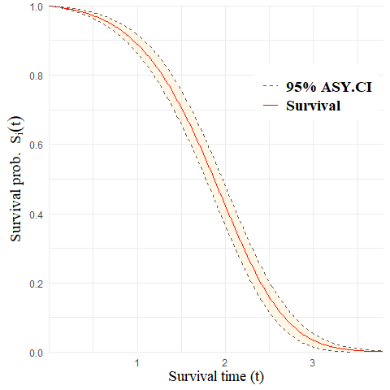
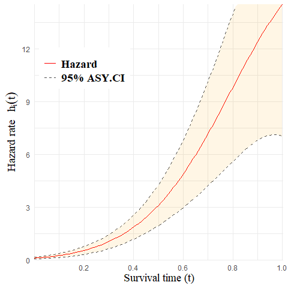

<!-- README.md is generated from README.Rmd. Please edit that file -->

# aftQnP

<!-- badges: start -->
<!-- badges: end -->

The goal of <code>aftQnP</code> is to provide a statistical tool for
fitting a semi-parametric accelerated failure time (AFT) mixture cure
model. Gaussian basis functions are employed to approximate the baseline
hazard function, and maximum penalized likelihood estimation is used to
obtain regression estimates and smooth estimates of the baseline hazard.
This method allows for the handling of partly interval-censored data,
which includes events, left-censored, right-censored, and
interval-censored observations.

## Installation

You can install the <code>aftQnP</code> package from
[GitHub](https://github.com/) with:

``` r
install.packages("devtools")
devtools::install_github("Isabellee4555/aftQnP")
```

## Fit a Model using a Simulated Dataset

This is a basic example which shows you how to fit a semi-parametric AFT
mixture cure mode:

``` r
library(aftQnP)
require(survival)
#> Loading required package: survival

# load data
data("simu_data")

# create a formula using a Surv
formula_aft <- Surv(y_L, y_R, type = "interval2") ~ X1 + X2 - 1

# fit a model
aft_fit <- aftsur(formula = formula_aft, cure_var = ~ Z1 + Z2 + Z3, offset = TRUE, data = simu_data)
```

## Summary Output

``` r
summary(aft_fit)
#> ---------------------------------------------------------------------------
#> Semi-parametric Accelerated Failure Time Mixture Cure Model Using MPL
#> 
#> Penalised log-likelihood: -367.538 
#> 
#> Estimated smoothing parameter: 0.004 
#> =====
#> 
#> Accelerated Failure Time Model:
#>      Estimate  Std.Error    Z Value     Pr(>|Z|)
#> X1  0.1890132 0.03345998   5.648932 1.614478e-08
#> X2 -0.5085308 0.03645698 -13.948792 3.199782e-44
#> 
#> =====
#> Logistic Model:
#>     Estimate Std.Error   Z Value     Pr(>|Z|)
#> Z1  1.561874 0.1337892 11.674141 1.728024e-31
#> Z2 -1.457772 0.4373015 -3.333563 8.574132e-04
#> Z3 -1.565340 0.4383270 -3.571169 3.553921e-04
#> ---------------------------------------------------------------------------
```

## Make a Prediction

``` r
predict(aft_fit, x = NULL, type = "survival", time = c(0.5, 1, 1.5), interval = TRUE)
#>   times  estimates     lower      upper
#> 1   0.5 0.88890025 0.8616654 0.91613514
#> 2   1.0 0.41755969 0.3607609 0.47435851
#> 3   1.5 0.03252873 0.0136310 0.05142647
```

## Plot a Predicted Baseline Survival Curve

``` r
plot_sur(fit = aft_fit, x = NULL)
```



## Plot a Predicted Baseline Hazard Curve

``` r
plot_hz(fit = aft_fit, x = NULL)
```


