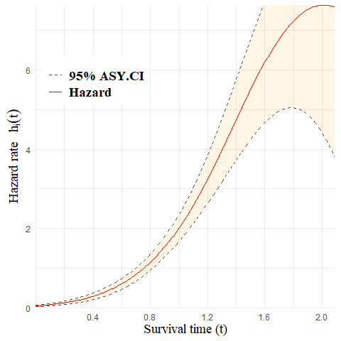

<!-- README.md is generated from README.Rmd. Please edit that file -->

# aftQnP

<!-- badges: start -->
<!-- badges: end -->

The goal of <code>aftQnP</code> is to provide a statistical tool for
fitting a semi-parametric accelerated failure time (AFT) mixture cure
model. Gaussian basis functions are employed to approximate the baseline
hazard function, and maximum penalized likelihood estimation is used to
obtain regression estimates and smooth estimates of the baseline hazard.
This method allows for the handling of partly interval-censored data,
which includes events, left-censored, right-censored, and
interval-censored observations.

## Installation

You can install the <code>aftQnP</code> package from
[GitHub](https://github.com/) with:

``` r
install.packages("devtools")
devtools::install_github("Isabellee4555/aftQnP")
```

## Fit a Model using a Simulated Dataset

This is a basic example which shows you how to fit a semi-parametric AFT
mixture cure mode:

<code>simu_data</code> is a simulated dataset supplied by the
<code>aftQnP</code> Package. This simulated data includes 500
observations with event, left, right, or interval censored survival
data. The <code>survival</code> Package is required to run the proposed
model. Model fitting is handled by the function <code>aftsur</code>,
where the first argument <code>formula</code> is a formula for the
latency (modelling the expected survival time for the non-cured group).
The second argument <code>cure_var</code> is a formula for the incidence
(modelling the chance of being cured). We set <code>offset = TRUE</code>
as the intercept covariate <code>Z1</code> is included in the data.
Alternatively, you can set <code>cure_var = \~ Z2 + Z3</code> and
<code>offset = FALSE</code>. The function <code>aftsur</code> will fit
the model and return an instance of the <code>aftsur</code> class.

``` r
library(aftQnP)
require(survival)
#> Loading required package: survival

# load data
data("simu_data")

# create a formula using a Surv
formula_aft <- Surv(y_L, y_R, type = "interval2") ~ X1 + X2 - 1

# fit a model
aft_fit <- aftsur(formula = formula_aft, cure_var = ~ Z1 + Z2 + Z3, offset = TRUE, data = simu_data)
```

## Summary Output

We can use a generic function <code>summary()</code> to obtain a summary
for the model.

``` r
summary(aft_fit)
#> ---------------------------------------------------------------------------
#> Semi-parametric Accelerated Failure Time Mixture Cure Model Using MPL
#> 
#> Penalised log-likelihood: -367.538 
#> 
#> Estimated smoothing parameter: 0.004 
#> =====
#> 
#> Accelerated Failure Time Model:
#>         Estimate  Std.Error    Z Value     Pr(>|Z|)
#> X1Yes  0.1890132 0.03345998   5.648932 1.614478e-08
#> X2    -0.5085308 0.03645698 -13.948792 3.199782e-44
#> 
#> =====
#> Logistic Model:
#>     Estimate Std.Error   Z Value     Pr(>|Z|)
#> Z1  1.561874 0.1337892 11.674141 1.728024e-31
#> Z2 -1.457772 0.4373015 -3.333563 8.574132e-04
#> Z3 -1.565340 0.4383270 -3.571169 3.553921e-04
#> ---------------------------------------------------------------------------
```

## Make a Prediction

We can make a prediction using the fitted model. For example, the
following code predict the baseline survival probability at timepoint
0.5, 1 and 1.5. Please note that x needs to be supplied as a dataframe
if not NULL.

``` r
predict(aft_fit, x = NULL, type = "survival", time = c(0.5, 1, 1.5), interval = TRUE)
#>   times  estimates     lower      upper
#> 1   0.5 0.88890025 0.8616654 0.91613514
#> 2   1.0 0.41755969 0.3607609 0.47435851
#> 3   1.5 0.03252873 0.0136310 0.05142647
```

We can also make a prediction for a specific observation, for example:

``` r
# create a dataframe with the same structure as the training data
test_data <- data.frame(X1 = factor("No", levels = c("No", "Yes")),
           X2 = -0.2)

# predict at timepoint 0.5
predict(aft_fit, x = test_data, type = "survival", time = c(0.5), interval = TRUE)
#>   times estimates     lower     upper
#> 1   0.5 0.9115261 0.8886502 0.9344021
```

You can also input multiple observations. For example, we can take the
first 5 observations from the training data and predict their hazard
rates at timepoint 0.5.

``` r
predict(aft_fit, x = simu_data[1:5, c("X1", "X2")], type = "hazard", time = c(0.5), interval = TRUE)
#>   times estimates     lower     upper
#> 1   0.5 0.4095154 0.3028240 0.5162067
#> 2   0.5 0.2715108 0.1825359 0.3604857
#> 3   0.5 0.2751718 0.1856628 0.3646807
#> 4   0.5 0.3497242 0.2501632 0.4492852
#> 5   0.5 0.5071349 0.3901259 0.6241440
```

## Plot a Predicted Baseline Survival Curve

<code>aftQnP</code> also provides graphic functions:
<code>plot_sur</code> and <code>plot_hz</code>. These functions plot the
estimated survival and hazard functions over time for a given
observation. When <code>x</code> is not supplied, the function returns
the plot for baseline estimates. For example, the following code will
plot the estimated baseline survival function. Please note that
<code>x</code> is a dataframe that contains latency variables with the
same structure as the training data. Unlike the ‘x’ in the
<code>predict</code> function, only one row of the dataframe is allowed
in <code>plot_sur</code> and <code>plot_sur</code>

``` r
plot_sur(fit = aft_fit, x = NULL)
```


## Plot a Predicted Baseline Hazard Curve

Finally, we can make prediction on the hazard function using a given
latency covariates. In this case, we use the <code>test_data</code> that
we just generated.

``` r
plot_hz(fit = aft_fit, x = test_data)
```


