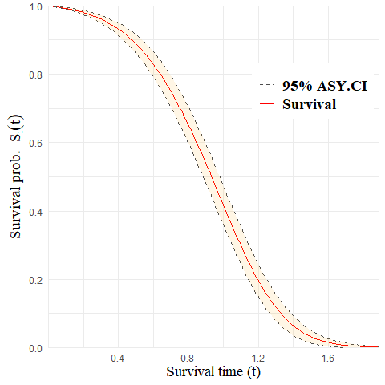

<!-- README.md is generated from README.Rmd. Please edit that file -->

# aftQnP

<!-- badges: start -->
<!-- badges: end -->

The goal of aftQnP is to provide a statistical tool to fit a
semi-parametric accelerated failure time (AFT) mixture cure model.
Gaussian basis functions are used to approximate the baseline hazard
function and maximum penalised likelihood estimation is used to obtain
regression estimates and smooth estimates of the baseline hazard. This
method allows partly interval-censored data which includes events, left,
right and interval-censored observations.

## Installation

You can install the aftQnP package from [GitHub](https://github.com/)
with:

``` r
install.packages("devtools")
devtools::install_github("Isabellee4555/Isabel_Li_Mres_Thesis_Rcode")
```

## Example

This is a basic example which shows you how to fit a semi-parametric AFT
mixture cure mode:

``` r
library(aftQnP)
require(survival)
#> Loading required package: survival
# load data
data("ptces")
# create Surv object
formula_aft <- Surv(y_L, y_R, type = "interval2") ~ X1 + X2 + X3 - 1
# fit model
model.fit <- aftsur(formula = formula_aft, cure_var = ~ Z1 + Z2 + Z3, offset = TRUE, data = ptces)
#> ---------------------------------------------------------------------------
#> Semi-parametric Accelerated Failure Time Mixture Cured Model Using MPL
#> 
#> Penalised log-likelihood: -154.66 
#> 
#> Estimated smoothing parameter: 0 
#> =====
#> 
#> Accelerated Failure Time Model:
#>      Estimate  Std.Error   Z value     Pr(>|Z|)
#> X1  0.9866690 0.07593183 12.994143 1.320798e-38
#> X2 -0.3726301 0.05394549 -6.907531 4.931628e-12
#> X3  0.5356306 0.02964506 18.068125 5.681217e-73
#> 
#> =====
#> Logistic Model:
#>     Estimate Std.Error   Z value     Pr(>|Z|)
#> Z1  2.789183 1.0201417  2.734113 0.0062548571
#> Z2 -2.067222 0.5644162 -3.662584 0.0002496837
#> Z3  1.112440 0.2876794  3.866942 0.0001102087
#> ---------------------------------------------------------------------------
```

To plot a predicted survival curve:

``` r
plot_sur(fit = model.fit, x = c(0.5, 2, -0.5))
```



To plot a predicted hazard curve:

``` r
plot_hz(fit = model.fit, x = c(0.5, 2, -0.5))
```


